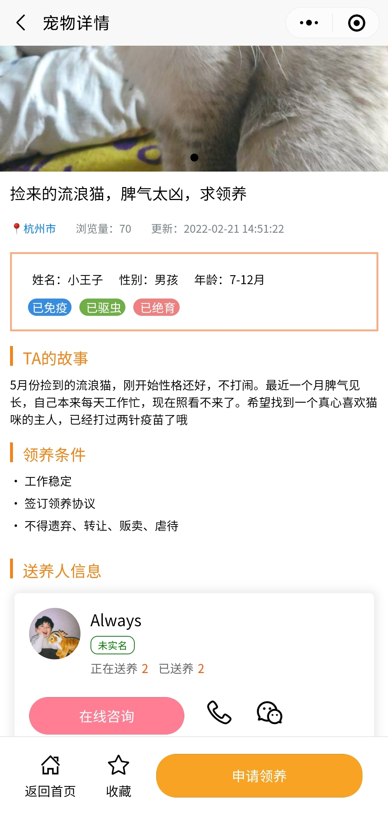

### 简介
    pet-life是一个宠物社区小程序

    主要功能有：
        宠物领养、寻宠、宠物社区、签到答题、对话咨询等。

### 核心技术
#### 依赖
- mysql5.7
- jdk1.8
#### 前端
- uniapp
- npm
- vue
- element-ui
- javascript
#### 后端
- springboot
- spring security
- redis
- mybatis
- mybatis-plus
- fastjson
- jwt

### 小程序截图
|||||
|---|---|---|---|
|||||
|---|---|---|---|
|||||

### 联系作者
 **微信：TL07061030** 

需要前后端源码联系作者

可查看演示小程序

